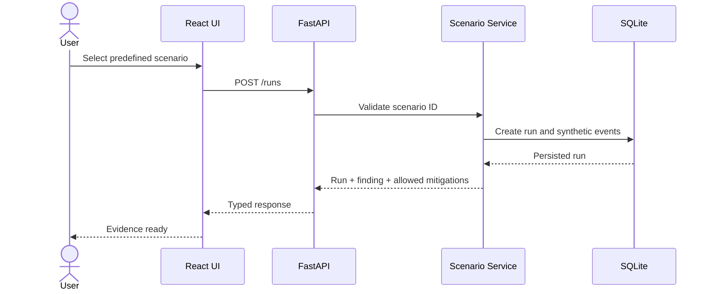
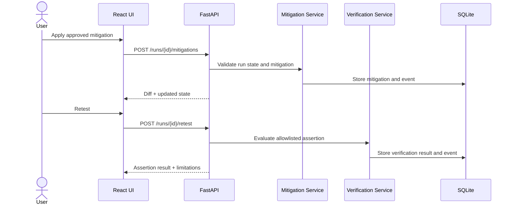

# AegisLoop Sequence Flows

## Simulation run

```mermaid
sequenceDiagram
  actor User
  participant UI as React UI
  participant API as FastAPI
  participant S as Scenario Service
  participant DB as SQLite
  User->>UI: Select predefined scenario
  UI->>API: POST /runs
  API->>S: Validate scenario ID
  S->>DB: Create run and synthetic events
  DB-->>S: Persisted run
  S-->>API: Run + finding + allowed mitigations
  API-->>UI: Typed response
  UI-->>User: Evidence ready
```

## Mitigation and retest

```mermaid
sequenceDiagram
  actor User
  participant UI as React UI
  participant API as FastAPI
  participant M as Mitigation Service
  participant V as Verification Service
  participant DB as SQLite
  User->>UI: Apply approved mitigation
  UI->>API: POST /runs/{id}/mitigations
  API->>M: Validate run state and mitigation
  M->>DB: Store mitigation and event
  API-->>UI: Diff + updated state
  User->>UI: Retest
  UI->>API: POST /runs/{id}/retest
  API->>V: Evaluate allowlisted assertion
  V->>DB: Store verification result and event
  API-->>UI: Assertion result + limitations
```
